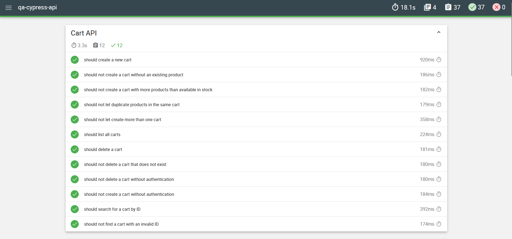

# ServeRest API Tests

[](https://github.com/victorbarsanele/qa-cypress-api/actions)


🇧🇷 [Português](#-português) | 🇺🇸 [English](#-english)

---

### 🇧🇷 Português

# Testes de API - ServeRest

Projeto de automação de API desenvolvido com Cypress para validar a API pública ServeRest.
Este projeto demonstra boas práticas em testes de API, isolamento de testes, integração contínua e geração automatizada de relatórios.

## 🚀 Visão Geral do Projeto

- Este repositório contém testes automatizados de API cobrindo:
- Gerenciamento de usuários (CRUD)
- Fluxo de autenticação
- Gerenciamento de produtos
- Operações de carrinho
- Cenários negativos e validações
- Autorização baseada em token
- Isolamento de dados com geração dinâmica
- O projeto está totalmente integrado ao GitHub Actions e gera relatórios HTML consolidados com Mochawesome.

## 🛠 Tecnologias Utilizadas

- Cypress
- JavaScript (Node.js)
- Mochawesome Reporter
- GitHub Actions (CI/CD)
- API Pública ServeRest

---

## 📦 Estrutura do Projeto

```bash
cypress/
├── e2e/            # Especificações de teste
├── fixtures/       # Massa de dados
├── support/        # Comandos customizados
├── reports/        # Relatórios gerados (ignorado pelo Git)
.github/
└── workflows/      # Configuração da CI
```

---

## ⚙️ Instalação

Clone o repositório:

```bash
git clone https://github.com/victorbarsanele/qa-cypress-api.git
cd qa-cypress-api
```

Instale as dependências:

```bash
npm install
```

---

## ▶️ Executando os Testes

Executar o Cypress em modo headless:

```bash
npm run cy:run
```

Executar o pipeline completo localmente (testes + merge + relatório HTML):

```bash
npm run test:full
```

Após a execução, o relatório HTML estará disponível em:

```bash
cypress/reports/html/report.html
```

---

## 🔄 Integração Contínua

O projeto está integrado ao GitHub Actions.

A cada push para a branch main:

- As dependências são instaladas
- Os testes do Cypress são executados
- Os relatórios JSON são consolidados
- O relatório HTML é gerado
- O relatório é publicado como artefato do workflow

Você pode baixar o relatório em:

Actions → Workflow Run → Artifacts

### **Report Preview**



---

## 🎯 Conceitos de Teste Demonstrados

- Comandos customizados no Cypress
- Geração dinâmica de dados de teste
- Encadeamento de requisições
- Manipulação de token
- Configuração de ambientes
- Estrutura modular de testes
- Publicação de artefatos na CI
- Boas práticas com Git (.gitignore)

---

## 🇺🇸 English

# ServeRest API Tests

API automation project built with Cypress to validate the public ServeRest API.
This project demonstrates API testing best practices, test isolation, CI integration and automated reporting.

## 🚀 Project Overview

This repository contains automated API tests covering:

- User management (CRUD)
- Authentication flow
- Product management
- Cart operations
- Negative scenarios and validations
- Token-based authorization
- Data isolation using dynamic data generation

The project is fully integrated with GitHub Actions and generates consolidated Mochawesome HTML reports.

## 🛠 Tech Stack

- Cypress
- JavaScript (Node.js)
- Mochawesome Reporter
- GitHub Actions (CI/CD)
- ServeRest Public API

## 📦 Project Structure

```bash
cypress/
├── e2e/            # Test specifications
├── fixtures/       # Test data
├── support/        # Custom commands
├── reports/        # Generated reports (ignored by Git)
.github/
└── workflows/      # CI configuration
```

---

## ⚙️ Installation

Clone the repository:

```bash
git clone https://github.com/victorbarsanele/qa-cypress-api.git
cd qa-cypress-api
```

Install dependencies:

```bash
npm install
```

---

## ▶️ Running Tests

Run Cypress in headless mode:

```bash
npm run cy:run
```

Run full pipeline locally (tests + merge + HTML report):

```bash
npm run test:full
```

After execution, the HTML report will be available at:

```bash
cypress/reports/html/report.html
```

---

## 🔄 Continuous Integration

The project is integrated with GitHub Actions.

On every push to `main`:

- Dependencies are installed
- Cypress tests are executed
- JSON reports are merged
- HTML report is generated
- Report is uploaded as a workflow artifact

You can download the report in:

Actions → Workflow Run → Artifacts

### **Report Preview**


---

## 🎯 Key Testing Concepts Demonstrated

- Custom Cypress commands
- Dynamic test data generation
- Request chaining
- Token handling
- Environment configuration
- Modular test structure
- CI artifact publishing
- Clean Git workflow (.gitignore best practices)

---
